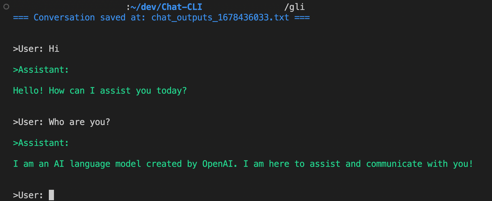

## ChatGPT CLI

A lightweight ChatGPT CLI - Chat completion. 

Interact with ChatGPT from your terminal and save the conversation in a text file.




## Get started 

### Docker

```
# Pull the docker container
docker pull imadelh/gli:latest

# Help
docker run --rm -it imadelh/gli ./gli -h

# Run with Openai token - https://platform.openai.com/account/api-keys
export OPENAI_TOKEN=xxx
docker run --rm -it -e OPENAI_TOKEN=$OPENAI_TOKEN imadelh/gli ./gli

# Run with a free endpoint 
docker run --rm -it imadelh/gli ./gli --endpoint 'https://chatgpt-api.shn.hk/v1/'
```

### Binary

```
# Macos
wget https://github.com/imadelh/Chat-CLI/releases/download/v0.1.21/gli-x86_64-apple-darwin.tar.gz
tar -xvf gli-x86_64-apple-darwin.tar.gz

# Linux
wget https://github.com/imadelh/Chat-CLI/releases/download/v0.1.21/gli-x86_64-unknown-linux-gnu.tar.gz
tar -xvf gli-x86_64-unknown-linux-gnu.tar.gz
```

## Usage 

```bash
./gli -h 

A simple CLI for ChatGPT.
Requires OPENAI_TOKEN env variable when using OpenAI endpoint.

USAGE:
    gli [OPTIONS]

FLAGS:
    -h, --help       Prints help information
    -V, --version    Prints version information

OPTIONS:
        --endpoint <endpoint>          ChatGPT API endpoint URL. [default:
                                       https://api.openai.com/v1/chat/completions]
        --output <output>              Output file path [default: chat_outputs]
        --temperature <temperature>    Temperature (between 0 and 1) [default: 1.0]

```

- Using OpenAI endpoint

```bash
export OPENAI_TOKEN=<put your key here - https://platform.openai.com/account/api-keys>

./gli --output 'my_chat'
```

- Using a free endpoint [ChatGPTAPIFree](https://github.com/ayaka14732/ChatGPTAPIFree)
```
# Token is not required
./gli --endpoint 'https://chatgpt-api.shn.hk/v1/'
```

## Dev

```
cargo run -- -h
cargo build --release
docker build -t gli -f Dockerfile .
```

 This my first Rust project to learn the basics, contributions are welcome.

TODO: 
- Add more error messages
- Support multiple models and system prompt
- Continue from an existing conversation (from a file)
- Add tests


----------